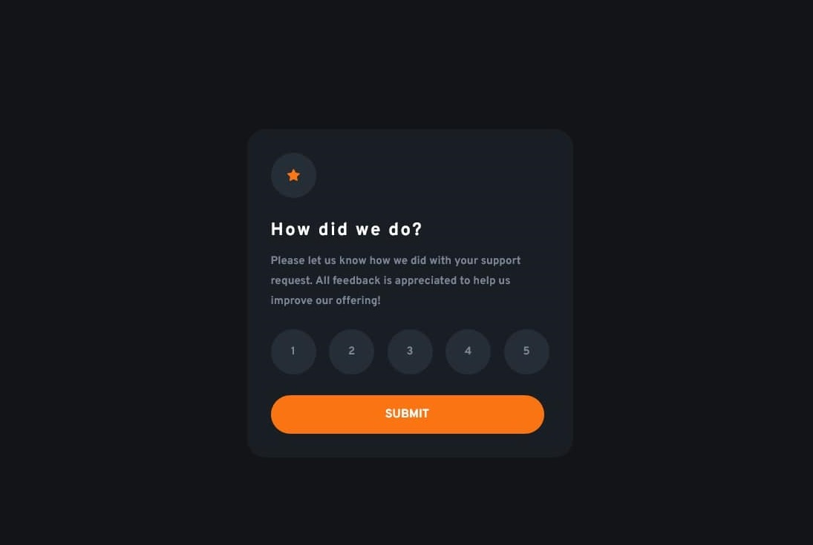

# Frontend Mentor - Interactive rating component solution

This is a solution to the [Interactive rating component challenge on Frontend Mentor](https://www.frontendmentor.io/challenges/interactive-rating-component-koxpeBUmI). Frontend Mentor challenges help you improve your coding skills by building realistic projects.

## Table of contents

- [Overview](#overview)
  - [The challenge](#the-challenge)
  - [Screenshot](#screenshot)
  - [Links](#links)
- [My process](#my-process)
  - [Built with](#built-with)
  - [What I learned](#what-i-learned)
  - [Continued development](#continued-development)
  - [Useful resources](#useful-resources)
- [Author](#author)

## Overview

This is an interactive rating card that lets you pick a rating and then displays the result along with a thank you message.

### The challenge

Users should be able to:

- View the optimal layout for the app depending on their device's screen size
- See hover states for all interactive elements on the page
- Select and submit a number rating
- See the "Thank you" card state after submitting a rating

### Screenshot

### Links

- Solution URL: [https://github.com/LouFagan/rating-component-main.loufagan.github.io]
- Live Site URL: [https://loufagan.github.io/rating-component-main.loufagan.github.io/]

## My process

For this project because there is not a big difference between mobile and desktop view, I started with desktop view and added a few media queries to adjust for smaller size afterwards.

### Built with

- Semantic HTML5 markup
- CSS custom properties
- Flexbox
- Vanilla Javascript
- Eric Meyer Css reset http://meyerweb.com/eric/tools/css/reset/

### What I learned

I learned how to unselect a previous choice/button when I select a different one.

### Continued development

Need to focus more on javascript and CSS. Perhaps try a longer project and use SASS and BEM.

### Useful resources

- MDN docs
- W3 Schools
- Stack Overflow

## Author

- Website - [https://pixelmein.ca]
- Frontend Mentor - [https://www.frontendmentor.io/profile/LouFagan]
